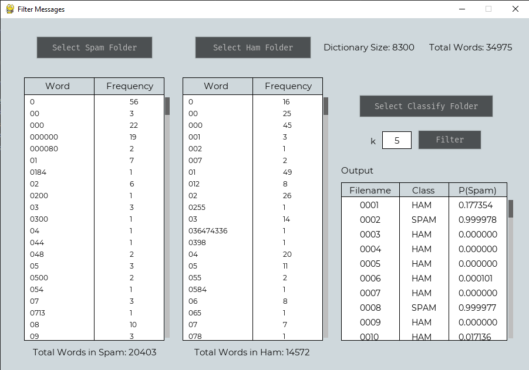

# Spam Message Filtering AI
This is a Python program that can filter batch messages using Naive-Laplace algorithm. The user interface is created with PyGame. This is one of my laboratory exercise in my AI course during junior year.

